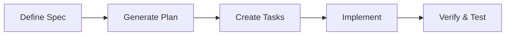

# AI-Assisted Development Tools & Frameworks

A comprehensive guide and resource repository for modern AI-assisted development methodologies, tools, and best practices. This repository provides explanations, guidelines, and demonstrations for leveraging AI coding assistants effectively in software development.

## 📖 Overview

This repository addresses the challenge of **"vibe coding"** — the practice of giving vague, iterative prompts to AI assistants that leads to unpredictable, inconsistent, and hard-to-maintain code. Instead, we focus on **structured, specification-driven approaches** that bring discipline and predictability to AI-assisted development.

## 🎯 Purpose

- **Educate**: Explain different AI-assisted development methodologies and their use cases
- **Guide**: Provide step-by-step workflows for implementing these frameworks
- **Compare**: Help teams choose the right approach for their projects
- **Demonstrate**: Offer practical examples and best practices

## 📚 Documentation

### Specification-Driven Development (SDD)

#### [GitHub SpecKit](./docs/SD-Spec%20Driven%20Development%20with%20GitHub%20SpecKit.md)

GitHub's official open-source toolkit (MIT-licensed) for formalizing Spec-Driven Development. Makes specifications living, central, and executable artifacts that guide AI assistants.

**Key Features:**

- Human-in-the-loop checkpoints
- Core artifacts: `constitution.md`, `spec.md`, `plan.md`, `tasks.md`
- Works with multiple AI assistants (Copilot, Claude, Cursor, Gemini)
- Gated workflow: Define → Plan → Breakdown → Execute → Verify

**Best For:** Teams wanting GitHub's official, well-documented approach to structured AI development.

---

#### [Fission AI OpenSpec](./docs/SD-Spec%20Driven%20Development%20with%20Fission%20AI%20OpenSpec.md)

A lightweight, open-source framework designed specifically for AI coding assistants to manage spec-driven development with version-controlled specification files.

**Key Features:**

- Four-stage workflow: Propose → Review & Refine → Apply → Archive
- Change-based approach with proposal/task tracking
- Excellent for brownfield (1→n) projects
- Tool-agnostic with native slash commands

**Best For:** Teams working on existing codebases who need a flexible, change-oriented approach.

---

### Multi-Agent Development

#### [BMAD (Breakthrough Method for Agile AI-Driven Development)](./docs/SD-Agile%20Software%20Development%20with%20BMad%20Code.md)

An agentic pipeline framework that uses specialized AI agents (Analyst, PM, Architect, Developer) working sequentially to solve the "context loss" problem in AI development.

**Key Features:**

- Role-based AI agents with specialized responsibilities
- CORE (Collaboration Optimized Reflection Engine) for agent management
- Three planning tracks: Quick Flow, BMAD Method, Brownfield
- Shifts developer role from "coder" to "director"

**Best For:** Complex projects requiring comprehensive planning and analysis before implementation.

---

### Comprehensive Overview

#### [AI-Assisted Development Overview](./docs/AI-assisted%20Development%20with%20SpecKit.md)

A presentation-style overview covering the principles, problems, and solutions in modern AI-assisted development. Includes best practices, limitations, and extensive learning resources.

**Topics Covered:**

- The "vibe coding" problem
- Core components and concepts
- Development loop transformations
- Best practices and recommendations
- Known limitations and considerations

---

## 🔄 Comparison Matrix

| Framework | Approach | Best Use Case | Complexity | Agent Support |
|-----------|----------|---------------|------------|---------------|
| **GitHub SpecKit** | Spec-first, gated workflow | New & existing projects | Medium | Multi-agent |
| **Fission OpenSpec** | Change-based, proposal-driven | Brownfield modifications | Low | Multi-agent |
| **BMAD** | Multi-agent pipeline | Complex greenfield projects | High | Multi-agent |

## 🚀 Getting Started

### Choose Your Framework

1. **For GitHub-centric teams**: Start with [GitHub SpecKit](./docs/SD-Spec%20Driven%20Development%20with%20GitHub%20SpecKit.md)
2. **For iterative changes**: Try [Fission OpenSpec](./docs/SD-Spec%20Driven%20Development%20with%20Fission%20AI%20OpenSpec.md)
3. **For complex planning**: Explore [BMAD](./docs/SD-Agile%20Software%20Development%20with%20BMad%20Code.md)

### Common Principles

All frameworks in this repository share these core principles:

- ✅ **Specification before implementation**
- ✅ **Human-in-the-loop review**
- ✅ **Structured, gated workflows**
- ✅ **Reproducible and verifiable results**
- ✅ **AI agent agnostic**

## 📋 Workflow Patterns

### Greenfield Projects (0→1)

### Brownfield Projects (1→n)

## 🛠️ Supported AI Assistants

All frameworks support multiple AI coding assistants:

- GitHub Copilot
- Cursor
- Claude (Anthropic)
- Gemini CLI
- And more...

## 📖 Learning Resources

### Official Documentation

- [SpecKit Official Site](https://speckit.org/)
- [GitHub SpecKit Repository](https://github.com/github/spec-kit)
- [Fission OpenSpec](https://github.com/fission-ai/openspec)

### Articles & Guides

- [GitHub Blog: Spec-driven development with AI](https://github.blog/ai-and-ml/generative-ai/spec-driven-development-with-ai-get-started-with-a-new-open-source-toolkit/)
- [Microsoft Developer: Diving Into Spec-Driven Development](https://developer.microsoft.com/blog/spec-driven-develop)
- [Intuition Labs: Guide to Spec-Driven AI Development](https://intuitionlabs.ai/articles/spec-driven-development-spec-kit)

## 🤝 Contributing

This repository is a living documentation project. Contributions are welcome:

- Share your experiences and case studies
- Add new framework documentation
- Improve existing guides
- Submit examples and demos

## 📝 Best Practices

### Do's ✅

- Keep tasks small and testable
- Provide rich, precise context to AI agents
- Treat generated code as reviewable artifacts
- Maintain traceability from spec to implementation
- Review and refine AI-generated specifications before implementation

### Don'ts ❌

- Don't skip human review checkpoints
- Don't rely solely on automated verification
- Don't use vague or ambiguous specifications
- Don't bypass the structured workflow for "quick fixes"
- Don't assume AI-generated code is secure without review

## ⚠️ Known Limitations

- AI agents can still produce incorrect or insecure code
- Requires cultural shift and team investment in spec quality
- Tooling maturity varies by agent and programming language
- Not a silver bullet — expert review still essential

## 📄 License

Documentation in this repository is provided for educational purposes. Individual frameworks have their own licenses (check respective repositories).

## 🔗 Quick Links

- [SpecKit Overview](./docs/AI-assisted%20Development%20with%20SpecKit.md) - Comprehensive presentation
- [GitHub SpecKit Guide](./docs/SD-Spec%20Driven%20Development%20with%20GitHub%20SpecKit.md) - Detailed implementation
- [OpenSpec Guide](./docs/SD-Spec%20Driven%20Development%20with%20Fission%20AI%20OpenSpec.md) - Change-driven approach
- [BMAD Guide](./docs/SD-Agile%20Software%20Development%20with%20BMad%20Code.md) - Multi-agent pipeline

---

**Last Updated**: November 21, 2025

*From chaotic "vibe coding" to structured, reproducible AI-assisted development.*
